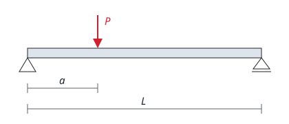
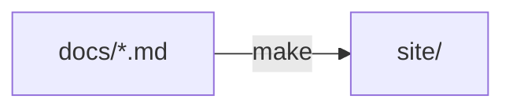

# 書き方の見本

このサイトで使える書き方の見本である．それぞれ，書き方（Markdown）のあとに，表示される形を示す．Markdownそのものの書き方は，研究室ハンドブックの「Markdown」にある．要らなくなったら，このページを消し，`mkdocs.yml` の `nav` からも外す．

## ページへのリンク {#links}

ほかのページへのリンクは，`.md` のファイル名で，このページからの場所を書く．見出しへのリンクは，`#` の後ろに見出しのidを書く．

```markdown
[はりのたわみ](notes/beam.md)の[荷重点のたわみ](notes/beam.md#deflection)を見る．
```

[はりのたわみ](notes/beam.md)の[荷重点のたわみ](notes/beam.md#deflection)を見る．

見出しの後ろの `{#deflection}` が，その見出しのidである．日本語の見出しには，英語のidを付けておく．付けないと，見出しを足したときにidが変わり，リンクが切れる．リンク切れは `make` で見つかる．

## 囲み {#admonition}

```markdown
!!! note "メモ"

    中身は4つの空白で字下げする．

??? question "クリックすると開く"

    折りたたまれた中身．
```

!!! note "メモ"

    中身は4つの空白で字下げする．

??? question "クリックすると開く"

    折りたたまれた中身．

`note` のほかに，`warning`（注意）や `tip`（ヒント）なども使える．

## 数式 {#math}

文の中の式は `$` で挟み，行を分けた式は `$$` の行で挟んで，LaTeXの書き方で書く．

```markdown
ひずみ $\varepsilon$ と応力 $\sigma$ の関係は，次のとおりである．

$$
\sigma = E \varepsilon
$$
```

ひずみ $\varepsilon$ と応力 $\sigma$ の関係は，次のとおりである．

$$
\sigma = E \varepsilon
$$

## 表 {#tables}

```markdown
| 試料 | 含水比 [%] |
|------|-----------:|
| A    | 18.2       |
| B    | 21.5       |
```

| 試料 | 含水比 [%] |
|------|-----------:|
| A    | 18.2       |
| B    | 21.5       |

`---:` のように右に `:` を付けた列は，右にそろう．数の列に使う．

## 画像 {#images}

画像は `docs/img/` に置き，このページからの場所で書く．`[ ]` の中には，画像に何が写っているかを書く．

```markdown

```


## 図を文字で書く（Mermaid） {#mermaid}

````markdown

````


## コードと注釈 {#code}

コードの行の終わりに `# (1)!` と書き，コードのすぐ後ろに番号付きの説明を書くと，行に注釈が付く．

````markdown
```sh
make serve # (1)!
```

1. 手元でサイトを開く．Ctrl+C で止める
````

```sh
make serve # (1)!
```

1. 手元でサイトを開く．Ctrl+C で止める
